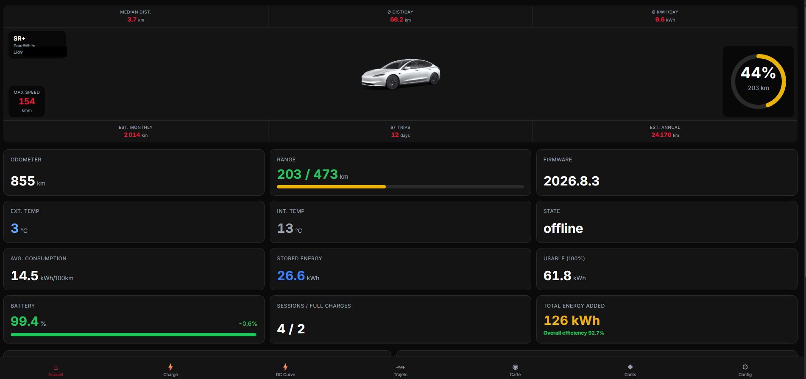
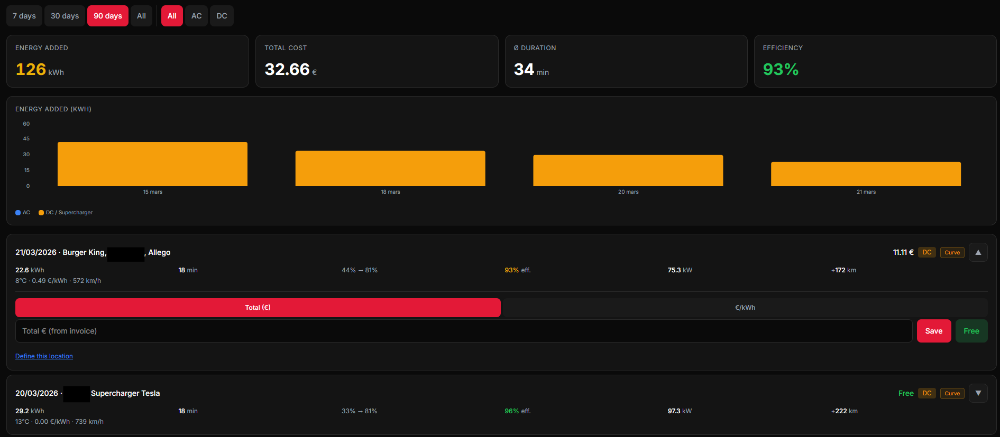
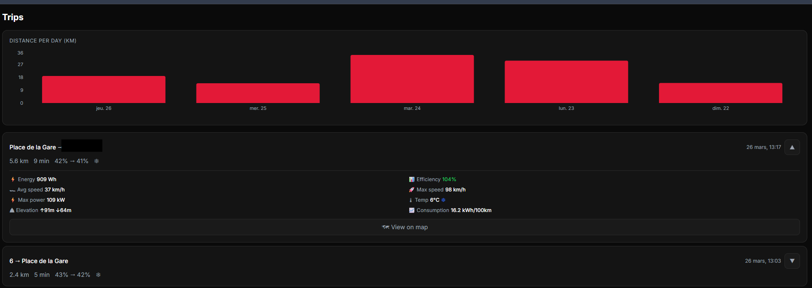
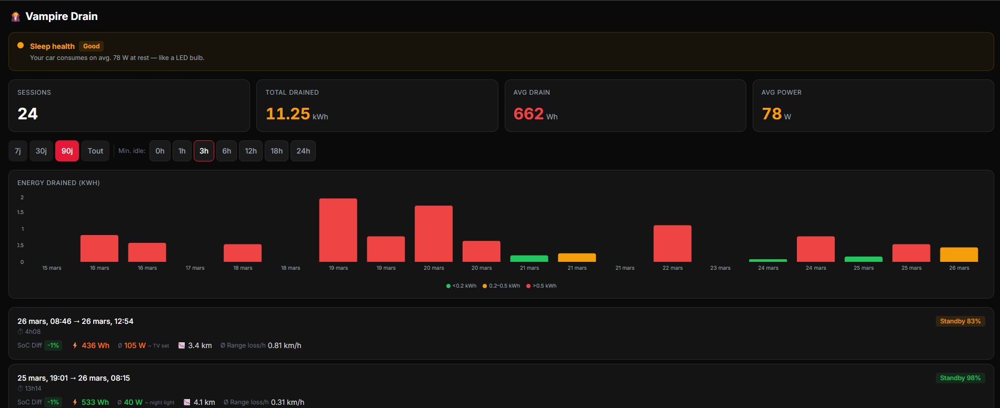
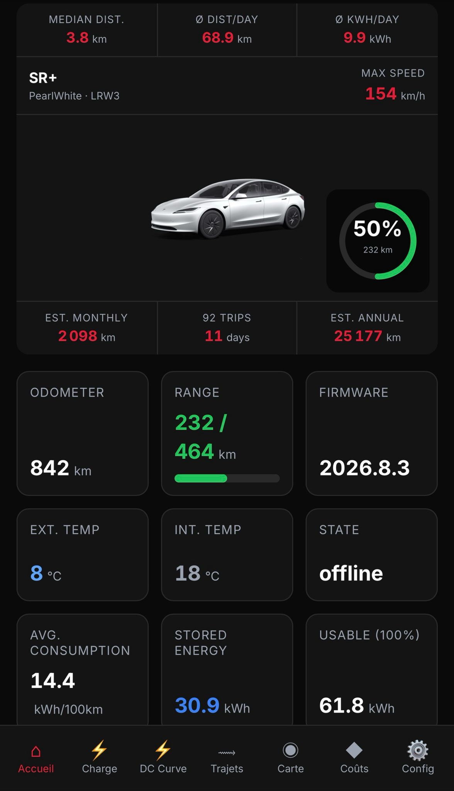

# TeslaHub

[](LICENSE)
[](https://github.com/Olrik-WP/TeslaHub/releases/latest)
[](https://github.com/Olrik-WP/TeslaHub/actions/workflows/docker-publish.yml)
[](https://hub.docker.com/r/deltawp/teslahub-api)
[](https://hub.docker.com/r/deltawp/teslahub-api)

A self-hosted companion dashboard for [TeslaMate](https://github.com/teslamate-org/teslamate), optimized for the Tesla in-car browser.



| Charging | Trips | Vampire Drain |
|:---:|:---:|:---:|
|  |  |  |

<details>
<summary>Mobile responsive</summary>


</details>

TeslaHub reads your existing TeslaMate data (read-only) and provides a touch-first, dark-themed interface with:

- Vehicle status, battery health, and position at a glance
- Charging sessions with manual cost tracking and DC charging curves
- Trip history with expandable details, efficiency metrics, and route visualization
- Vampire drain analysis with sleep health verdict and power analogies
- Interactive map with historical data
- Cost analytics by location, month, and period
- Multi-car support
- Internationalization (English / French)
- **Optional** real-time Sentry / break-in alerts via Tesla Fleet Telemetry — see [Security Alerts](#security-alerts-optional)

TeslaMate remains your telemetry source. TeslaHub is the UX layer.

## Architecture

```
Your Server (Docker)
├── TeslaMate           (existing)
├── PostgreSQL          (existing — hosts both teslamate and teslahub databases)
├── Mosquitto           (existing or new — MQTT broker)
├── Grafana             (existing)
├── TeslaHub Init       (one-shot — creates DB users automatically)
├── TeslaHub API        (ASP.NET Core 9 — reads TeslaMate DB + MQTT live data)
└── TeslaHub Web        (React + Caddy — serves the UI)
```

TeslaHub connects to your existing PostgreSQL instance via the Docker internal network, just like Grafana does. Your TeslaMate database is **never modified** — TeslaHub uses a read-only user.

Optionally, TeslaHub also connects to TeslaMate's MQTT broker to receive **live vehicle data** (door/trunk/frunk status, lock state, Sentry Mode, TPMS warnings, preconditioning). See [MQTT Setup](#mqtt-setup-live-vehicle-status) below.

---

## Installation

### Prerequisites

- A running [TeslaMate](https://docs.teslamate.org/docs/installation/docker) installation with Docker Compose
- Docker and Docker Compose v2+

### Step 1 — Add TeslaHub variables to your `.env`

In the same directory as your TeslaMate `docker-compose.yml`, add these variables to your `.env` file:

```env
# TeslaHub database passwords (choose strong passwords)
TESLAHUB_READER_PASS=choose_a_strong_password_1
TESLAHUB_APP_PASS=choose_a_strong_password_2

# TeslaHub admin login
TESLAHUB_ADMIN_USER=admin
TESLAHUB_ADMIN_PASSWORD=choose_a_strong_password_3

# Session duration (days the browser stays logged in)
TESLAHUB_SESSION_DAYS=30

# JWT secret (generate a random 64-character string)
TESLAHUB_JWT_SECRET=generate_a_64_char_random_string

# Optional — custom map tiles (default: OpenStreetMap)
# MAP_TILE_URL=https://tile.openstreetmap.org/{z}/{x}/{y}.png

# Optional — restrict access by IP (empty = allow all)
# TESLAHUB_ALLOWED_IPS=192.168.1.0/24

# Optional — MQTT for live vehicle status (doors, trunk, lock, sentry...)
# See "MQTT Setup" section below
MQTT_HOST=mosquitto
MQTT_PORT=1883
# MQTT_USER=
# MQTT_PASSWORD=
```

> **Tip:** Generate a JWT secret with: `openssl rand -hex 32`

**If you don't use a `.env` file**, add the variables directly in the `environment:` section of each service (see Step 2).

### Step 2 — Add TeslaHub services to your `docker-compose.yml`

Add the following services to your **existing** TeslaMate `docker-compose.yml`:

```yaml
  teslahub-init:
    image: deltawp/teslahub-init:latest
    restart: "no"
    environment:
      - TM_DB_HOST=database
      - TM_DB_PORT=5432
      - TM_DB_NAME=${TM_DB_NAME:-teslamate}
      - TM_DB_USER=${TM_DB_USER:-teslamate}
      - TM_DB_PASS=${TM_DB_PASS}
      - TESLAHUB_READER_PASS=${TESLAHUB_READER_PASS}
      - TESLAHUB_APP_PASS=${TESLAHUB_APP_PASS}
    depends_on:
      - database

  teslahub-api:
    image: deltawp/teslahub-api:latest
    restart: always
    environment:
      - TM_DB_HOST=database
      - TM_DB_PORT=5432
      - TM_DB_NAME=${TM_DB_NAME:-teslamate}
      - TM_DB_USER=teslahub_reader
      - TM_DB_PASSWORD=${TESLAHUB_READER_PASS}
      - APP_DB_HOST=database
      - APP_DB_PORT=5432
      - APP_DB_NAME=teslahub
      - APP_DB_USER=teslahub_app
      - APP_DB_PASSWORD=${TESLAHUB_APP_PASS}
      - TESLAHUB_ADMIN_USER=${TESLAHUB_ADMIN_USER:-admin}
      - TESLAHUB_ADMIN_PASSWORD=${TESLAHUB_ADMIN_PASSWORD}
      - TESLAHUB_SESSION_DAYS=${TESLAHUB_SESSION_DAYS:-30}
      - TESLAHUB_JWT_SECRET=${TESLAHUB_JWT_SECRET}
      - MAP_TILE_URL=${MAP_TILE_URL:-https://tile.openstreetmap.org/{z}/{x}/{y}.png}
      - TESLAHUB_ALLOWED_IPS=${TESLAHUB_ALLOWED_IPS:-}
      - MQTT_HOST=${MQTT_HOST:-}
      - MQTT_PORT=${MQTT_PORT:-1883}
      - MQTT_USER=${MQTT_USER:-}
      - MQTT_PASSWORD=${MQTT_PASSWORD:-}
      - MQTT_NAMESPACE=${MQTT_NAMESPACE:-}
      - TZ=${TZ:-Europe/Paris}
    ports:
      - "127.0.0.1:4001:8080"
    depends_on:
      - database
      - teslahub-init

  teslahub-web:
    image: deltawp/teslahub-web:latest
    restart: always
    ports:
      - "127.0.0.1:4002:80"
    depends_on:
      - teslahub-api
```

> **Note:** `database` refers to your existing PostgreSQL service name. If yours is named differently (e.g., `db` or `postgres`), adjust the `TM_DB_HOST`, `APP_DB_HOST`, and `depends_on` values accordingly.

> **Without `.env` file?** Replace variables like `${TM_DB_PASS}` with their actual values directly in the YAML.

### Step 3 — Start

```bash
docker compose up -d
```

The `teslahub-init` container will automatically:
1. Wait for PostgreSQL to be ready
2. Create a `teslahub_reader` user (read-only access to your TeslaMate database)
3. Create a `teslahub` database
4. Create a `teslahub_app` user (full access to the TeslaHub database)

Then `teslahub-api` starts and auto-migrates the TeslaHub database schema.

TeslaHub is now available at **http://your-server:4002**.

---

## MQTT Setup (Live Vehicle Status)

TeslaMate publishes real-time vehicle data to an MQTT broker (Mosquitto). Some data — like door/trunk/frunk status, lock state, Sentry Mode, TPMS pressure warnings, and preconditioning — is **only available via MQTT** and is never stored in the PostgreSQL database.

TeslaHub can connect to this MQTT broker to display these live features on the Home page.

### What you need

1. **A Mosquitto broker** running in your Docker stack
2. **TeslaMate with MQTT enabled** (i.e. `DISABLE_MQTT` must NOT be set to `true`)

> **⚠️ Important:** If your TeslaMate has `DISABLE_MQTT=true`, you must remove this line (or set `MQTT_HOST=mosquitto` instead) for MQTT to work. Without it, TeslaMate will not publish any data to the broker and live vehicle status will be unavailable in TeslaHub.

### If you already have Mosquitto

Most TeslaMate installations include Mosquitto. Just add `MQTT_HOST=mosquitto` to your `.env` (or to the `teslahub-api` environment) where `mosquitto` is the Docker service name of your broker.

### If you don't have Mosquitto yet

Add this service to your `docker-compose.yml`:

```yaml
  mosquitto:
    image: eclipse-mosquitto:2
    restart: always
    command: mosquitto -c /mosquitto-no-auth.conf
    ports:
      - "127.0.0.1:1883:1883"
    volumes:
      - mosquitto-data:/mosquitto/data
```

And add `mosquitto-data:` to your `volumes:` section.

Then update your TeslaMate service:
- Remove `DISABLE_MQTT=true`
- Add `MQTT_HOST=mosquitto`

### What happens without MQTT?

TeslaHub works perfectly fine without MQTT. All database-backed features (charging, trips, statistics, battery health, TPMS pressures, climate on/off, temperatures, etc.) continue to work.

Only the following **live features** require MQTT:

| Feature | MQTT Topic |
|---|---|
| Door status (open/closed) | `teslamate/cars/$id/doors_open` |
| Trunk status | `teslamate/cars/$id/trunk_open` |
| Frunk status | `teslamate/cars/$id/frunk_open` |
| Window status | `teslamate/cars/$id/windows_open` |
| Lock state | `teslamate/cars/$id/locked` |
| Sentry Mode | `teslamate/cars/$id/sentry_mode` |
| User present | `teslamate/cars/$id/is_user_present` |
| TPMS warnings | `teslamate/cars/$id/tpms_soft_warning_*` |
| Climate keeper mode | `teslamate/cars/$id/climate_keeper_mode` |
| Preconditioning | `teslamate/cars/$id/is_preconditioning` |

When MQTT is not connected, TeslaHub shows a subtle indicator and hides the body/security panel.

---

## Security Alerts (optional)

TeslaHub can optionally connect to your Tesla account via the official **Tesla Fleet API** to deliver real-time security features that go beyond what TeslaMate can capture — most importantly the `SentryModeStateAware` event raised when Sentry detects activity around the vehicle, and break-in detection. Alerts are pushed to Telegram in seconds.

### What you get

- 🚨 Instant Telegram notification when Tesla Sentry detects activity (`SentryModeStateAware` / `Panic`).
- 🔓 Break-in detection (vehicle locked but a door / trunk / frunk opens).
- 👥 Per-recipient routing: multiple Telegram chats can be configured, each subscribed to specific vehicles, with Sentry and break-in toggles per (recipient, vehicle) pair.
- 📜 Last 500 alerts kept in PostgreSQL with delivery status.
- 🛠 Full setup wizard inside TeslaHub Settings — copy-paste for every Tesla developer app field, QR code for vehicle pairing, "Send test" button for Telegram.

### Philosophy: 100% self-hosted, zero third party

TeslaHub never relies on a shared backend. Each TeslaHub installation registers its **own** Tesla developer app and runs its **own** Tesla Fleet Telemetry server. Your Tesla tokens, vehicle data, and alerts never leave your machine.

> **Credit:** the architecture is heavily inspired by the excellent open-source project [SentryGuard](https://github.com/abarghoud/SentryGuard) by Anas Barghoud (AGPL-3.0). TeslaHub re-implements the same concepts in C#/.NET so they fit naturally into the existing TeslaHub stack — and crucially, does so **without any shared infrastructure**.

### What you need

- A public domain name (TeslaHub web on a proxied subdomain + a DNS-only telemetry subdomain — see [Telemetry stack](#telemetry-stack-self-hosted-fleet-telemetry-server) below).
- A free Tesla developer app at [developer.tesla.com](https://developer.tesla.com).
- A personal Telegram bot (created in 30 seconds via [@BotFather](https://t.me/BotFather)).

Everything stays on **your** server. No third-party cloud, no shared client_id, no relayed messages.

### Step 1 — Create your Tesla developer app (5 min, free)

> 💡 The same instructions are also displayed inside TeslaHub: open **Settings → Security Alerts** and follow the embedded "0. Create your Tesla developer app" guide. Each value has a one-click copy button.

1. Open [developer.tesla.com](https://developer.tesla.com), click **Sign in** and use your existing Tesla account credentials.
2. From the left menu, go to **Apps**, then click **Create New App**.
3. Fill in the form with:
   - **App Name:** `TeslaHub Self-Hosted`
   - **Description:** `Personal companion dashboard for TeslaMate`
   - **Allowed Origin URL:** `https://teslahub.yourdomain.com`
   - **Allowed Redirect URI:** `https://teslahub.yourdomain.com/api/tesla-oauth/callback`
   - **Scopes:** `openid`, `offline_access`, `vehicle_device_data`, `vehicle_cmds`
4. Click **Submit**. Tesla returns a `Client ID` and a `Client Secret`. Keep them safe — the secret is shown only once.

### Step 2 — Add the variables to your `.env`

```env
# Optional — Security Alerts (Tesla Fleet API)
TESLA_CLIENT_ID=your_tesla_client_id
TESLA_CLIENT_SECRET=your_tesla_client_secret
TESLA_REDIRECT_URI=https://teslahub.yourdomain.com/api/tesla-oauth/callback

# Region — pick the audience matching your Tesla account region
# EU:    https://fleet-api.prd.eu.vn.cloud.tesla.com   (default)
# NA/AP: https://fleet-api.prd.na.vn.cloud.tesla.com
TESLA_AUDIENCE=https://fleet-api.prd.eu.vn.cloud.tesla.com

# Master switch — set to true to start the telemetry consumer.
# The full feature also requires the Telegram + telemetry stack
# variables documented further down. Default false keeps everything
# off, including for users who do not want this feature.
SECURITY_ALERTS_ENABLED=true
```

### Step 3 — Wire them into your `teslahub-api` service

Add the new variables to the `environment:` block of `teslahub-api` in your `docker-compose.yml`:

```yaml
  teslahub-api:
    environment:
      # ... existing variables ...
      - TESLA_CLIENT_ID=${TESLA_CLIENT_ID:-}
      - TESLA_CLIENT_SECRET=${TESLA_CLIENT_SECRET:-}
      - TESLA_REDIRECT_URI=${TESLA_REDIRECT_URI:-}
      - TESLA_AUDIENCE=${TESLA_AUDIENCE:-}
      - SECURITY_ALERTS_ENABLED=${SECURITY_ALERTS_ENABLED:-false}
```

If you leave the variables empty, the feature simply stays inactive — TeslaHub continues to work as before.

### Step 4 — Restart and connect

```bash
docker compose up -d teslahub-api
```

Open TeslaHub → **Settings** → scroll to the **Security Alerts** card → click **Connect Tesla account**. You will be redirected to `auth.tesla.com`, sign in, and return to TeslaHub. Your Tesla tokens are now stored encrypted with AES-GCM in your local `teslahub` PostgreSQL database and refreshed automatically every ~30 minutes.

> Until you complete this step, the Home page shows a small dismissible banner reminding you that Security Alerts can be set up. The banner disappears automatically as soon as your Tesla account is connected.

### Pairing your vehicles (after Tesla OAuth)

Once your Tesla account is connected, the Settings card unfolds a 3-step wizard:

1. **Generate the public key for your domain.** TeslaHub creates an EC P-256 keypair, encrypts the private key at rest with AES-GCM, and exposes the public key (PEM, `SubjectPublicKeyInfo`) at `https://<your-domain>/.well-known/appspecific/com.tesla.3p.public-key.pem`. The wizard provides a clickable test link so you can confirm Tesla can fetch it.
2. **Register your domain with Tesla** as a third-party partner. TeslaHub calls `POST /api/1/partner_accounts` on your behalf using your account's access token. Tesla pulls your public key from the `.well-known` URL above to confirm.
3. **Pair each vehicle.** TeslaHub generates a QR code pointing to `https://tesla.com/_ak/<your-domain>`. Scan it with your iPhone, the Tesla mobile app opens and asks you to approve TeslaHub's virtual key for the selected vehicle. Repeat for each car. Click *I've approved* in TeslaHub once done.

**Caddy snippet** for the well-known endpoint (already covered if your existing reverse-proxy block sends `/api/*` and the `/.well-known/*` path to `teslahub-api`). Example:

```caddyfile
teslahub.yourdomain.com {
    reverse_proxy /.well-known/appspecific/* teslahub-api:8080
    reverse_proxy /api/*                     teslahub-api:8080
    reverse_proxy /                          teslahub-web:80
}
```

### Telemetry stack (self-hosted Fleet Telemetry server)

This is where the actual Sentry events start flowing into your TeslaHub. **Two extra services** are added on demand via a Docker Compose `profile`, so they only run when you opt in.

#### What you need

- A **separate sub-domain** dedicated to telemetry, e.g. `telemetry.yourdomain.com`.
- That sub-domain must be **DNS-only** on Cloudflare (gray cloud — *not* the orange proxy). The reason is Tesla connects to your server with **mutual TLS**: the vehicle presents a certificate signed by Tesla. The Cloudflare proxy does not forward client certificates on free / Pro plans, so TLS termination must happen on your origin.
- An **inbound port forward** from your router/box to the host (default `8443`).
- The Tesla **server CA** file (downloadable from the Tesla Fleet API documentation) placed at `./fleet-telemetry/server-ca.crt`.

#### DNS — Cloudflare example

```
teslahub.yourdomain.com    A   <your home ip>   🟠 proxied    (web UI + API)
telemetry.yourdomain.com   A   <your home ip>   ⚪ DNS only   (Tesla mTLS)
```

> Security note: DNS-only exposes your origin IP for that sub-domain. Realistic risk for a personal install is low, but you can mitigate by limiting source IPs at the firewall to the Tesla cloud ranges if you want to harden it further. The Fleet Telemetry server itself rejects any TLS handshake without a valid Tesla-signed client cert, which is a strong layer-7 filter.

#### Caddy snippet

Add a stanza for the telemetry sub-domain. Caddy fetches and renews the cert via Let's Encrypt automatically, and stores it in a volume that the Fleet Telemetry container reads:

```caddyfile
teslahub.yourdomain.com {
    reverse_proxy /.well-known/appspecific/* teslahub-api:8080
    reverse_proxy /api/*                     teslahub-api:8080
    reverse_proxy /                          teslahub-web:80
}

# The telemetry sub-domain only exists so Caddy keeps a cert for it
# in /data/caddy/certificates/.../telemetry.yourdomain.com/. The actual
# TLS connection from Tesla terminates at the fleet-telemetry container
# which mounts the same volume read-only.
telemetry.yourdomain.com {
    tls {
        on_demand
    }
    respond 404
}
```

Reload Caddy: `caddy reload`.

#### Configuration files

```bash
mkdir -p fleet-telemetry
cp fleet-telemetry/config.json.example fleet-telemetry/config.json
# Edit fleet-telemetry/config.json: replace ${TELEMETRY_DOMAIN} placeholders
# with your real telemetry sub-domain.
```

Place the Tesla server CA at `fleet-telemetry/server-ca.crt`.

#### .env additions

```env
# Optional — Security Alerts telemetry stack
TELEMETRY_DOMAIN=telemetry.yourdomain.com
TELEMETRY_PORT=8443
# Path inside the API container where the Tesla CA is mounted (used when
# calling /api/1/vehicles/fleet_telemetry_config_create on Tesla).
TELEMETRY_CA_PATH=/etc/teslahub/server-ca.crt
# Name of the Caddy data volume that holds the Let's Encrypt certs.
CADDY_DATA_VOLUME=caddy-data
```

Add a read-only mount of the Tesla CA into `teslahub-api`:

```yaml
  teslahub-api:
    volumes:
      - ./fleet-telemetry/server-ca.crt:/etc/teslahub/server-ca.crt:ro
```

#### Start the stack

```bash
docker compose -f docker-compose.yml -f docker-compose.security-alerts.yml \
    --profile security-alerts up -d nats fleet-telemetry
```

The stack stays inactive without `--profile security-alerts` so existing TeslaHub installations are unaffected.

#### Tell Tesla to start streaming

Once everything above is up and your vehicles are paired, click **Configure telemetry** in the Settings wizard. TeslaHub calls Tesla's `/api/1/vehicles/fleet_telemetry_config_create` for the selected VINs with your hostname, port and CA. Tesla then opens a persistent mTLS WebSocket from each car to your `fleet-telemetry` container, which forwards events to the `tesla.telemetry.>` subjects on NATS.

### Receiving notifications (Telegram)

The final piece is delivery. TeslaHub speaks directly to `api.telegram.org` — there is no intermediate notification service.

#### Create your personal Telegram bot

1. Open Telegram and start a chat with [@BotFather](https://t.me/BotFather).
2. Send `/newbot`, pick a display name (e.g. *My TeslaHub Alerts*) and a username ending in `bot`.
3. BotFather gives you an HTTP API token like `123456789:ABCdef...`. Treat this as a secret.
4. Open your new bot in Telegram and send `/start` so the bot can later message you.

#### Add the bot token to your `.env`

```env
# Optional — Telegram bot for security alerts
TELEGRAM_BOT_TOKEN=123456789:ABCdef...
```

Restart the API:

```bash
docker compose up -d teslahub-api
```

#### Add recipients

In TeslaHub → **Settings → Security Alerts**, scroll down to *Notification recipients*. For each person who should receive alerts:

1. Find their Telegram chat ID by sending any message to [@userinfobot](https://t.me/userinfobot) on Telegram — it replies with the numeric `id`.
2. Add a recipient (Name + chat ID + language).
3. Click **Send test** — they should receive a Telegram message instantly.
4. In the *Sentry* / *Break-in* matrix below the recipient, tick the vehicles each person should be notified about.

You can have multiple recipients per vehicle, or scope each person to specific cars (e.g. spouse only receives alerts for their own car).

### What gets detected

| Alert | Trigger | Source |
|---|---|---|
| **Sentry alert** | `SentryModeStateAware` or `SentryModeStatePanic` published by the vehicle | Fleet Telemetry `V` records, field `SentryMode` |
| **Break-in** | `Locked = true` while `DoorState` reports an open door | Fleet Telemetry `V` records, fields `Locked` + `DoorState` |

The full alert history (last 500) is visible in the *Recent alerts* panel of Settings, with delivery status (notified / failed) for each event.

### Reliability notes

- The NATS stream is configured with **24h retention** (file-backed JetStream) so a TeslaHub restart never loses an alert.
- The API container reconnects to NATS automatically with a 10-second back-off if the broker is unavailable.
- Telegram failures are recorded in the alert event row (`failureReason`) so you can diagnose via the *Recent alerts* panel.
- Tesla OAuth tokens are refreshed proactively every 30 minutes; failures are surfaced in Settings.

### Security model

- **Tokens at rest:** AES-GCM (256-bit), key derived from `TESLAHUB_JWT_SECRET` via SHA-256.
- **OAuth state:** signed JWT with HS256, 10-minute expiry, audience-checked.
- **Token refresh:** automatic background refresh every 30 minutes, 60-minute proactive horizon.
- **Disconnect:** removes tokens and associated vehicles from the database immediately.
- **Network:** TeslaHub talks directly to `auth.tesla.com` and `fleet-auth.prd.vn.cloud.tesla.com` — no intermediate service.

### Why is the feature "optional"?

Because it requires a public domain name and a Tesla developer app, which is more setup than most TeslaHub users want. The feature is opt-in: the new environment variables default to empty, the Settings card shows clear instructions, and the rest of TeslaHub continues to work exactly as before for users who don't enable it.

---

## Reverse Proxy (HTTPS)

TeslaHub listens on `127.0.0.1` only. To expose it over HTTPS, use a reverse proxy.

### Caddy (recommended)

Add to your Caddyfile:

```
teslahub.yourdomain.com {
    reverse_proxy localhost:4002
}
```

Caddy handles TLS certificates automatically. Reload with `caddy reload`.

### Nginx

```nginx
server {
    listen 443 ssl http2;
    server_name teslahub.yourdomain.com;

    ssl_certificate     /path/to/cert.pem;
    ssl_certificate_key /path/to/key.pem;

    location / {
        proxy_pass http://127.0.0.1:4002;
        proxy_set_header Host $host;
        proxy_set_header X-Real-IP $remote_addr;
        proxy_set_header X-Forwarded-For $proxy_add_x_forwarded_for;
        proxy_set_header X-Forwarded-Proto $scheme;
    }
}
```

---

## Updating

Pull the latest images and restart:

```bash
docker compose pull teslahub-init teslahub-api teslahub-web
docker compose up -d teslahub-init teslahub-api teslahub-web
```

Or use the update script:

```bash
curl -fsSL https://raw.githubusercontent.com/Olrik-WP/TeslaHub/main/update.sh -o update.sh
chmod +x update.sh
./update.sh
```

Options:
- `./update.sh --clean` — remove dangling images after update
- `./update.sh --full-clean` — prune all unused images and build cache
- `./update.sh --logs` — show logs after restart

Your data is safe — TeslaHub data lives in the PostgreSQL volume. Only the application containers are replaced.

---

## Configuration Reference

| Variable | Default | Description |
|---|---|---|
| `TESLAHUB_READER_PASS` | *(required)* | Password for the read-only TeslaMate DB user |
| `TESLAHUB_APP_PASS` | *(required)* | Password for the TeslaHub app DB user |
| `TESLAHUB_ADMIN_USER` | `admin` | Login username for TeslaHub |
| `TESLAHUB_ADMIN_PASSWORD` | *(required)* | Login password for TeslaHub |
| `TESLAHUB_SESSION_DAYS` | `30` | How long the browser stays logged in |
| `TESLAHUB_JWT_SECRET` | *(required)* | Secret key for JWT signing |
| `MAP_TILE_URL` | OpenStreetMap | Custom tile server URL |
| `TESLAHUB_ALLOWED_IPS` | *(empty = all)* | Restrict access by IP/CIDR |
| `MQTT_HOST` | *(empty = disabled)* | MQTT broker hostname (e.g. `mosquitto`). Enables live vehicle status |
| `MQTT_PORT` | `1883` | MQTT broker port |
| `MQTT_USER` | *(empty)* | MQTT username (if broker requires auth) |
| `MQTT_PASSWORD` | *(empty)* | MQTT password |
| `MQTT_NAMESPACE` | *(empty)* | TeslaMate MQTT namespace (if configured) |
| `TZ` | `Europe/Paris` | Timezone |

---

## Security

- Passwords are hashed with bcrypt
- JWT access tokens (short-lived) + httpOnly refresh tokens (configurable duration)
- Progressive lockout on failed login attempts (exponential backoff)
- Optional IP whitelisting via `TESLAHUB_ALLOWED_IPS`
- TeslaMate database access is strictly read-only
- You can change your password from Settings after first login

---

## Development

For contributors who want to build from source:

```bash
git clone https://github.com/Olrik-WP/TeslaHub.git
cd TeslaHub

# Start everything with local builds
docker compose -f docker-compose.dev.yml up -d --build

# Or run services individually:
# Backend
cd src/TeslaHub.Api
dotnet run

# Frontend
cd src/TeslaHub.Web
npm install
npm run dev
```

---

## Tech Stack

- **Backend:** ASP.NET Core 9 Minimal API, Dapper, Entity Framework Core, PostgreSQL
- **Frontend:** React 18, Vite, TypeScript, Tailwind CSS, TanStack Query, Recharts, Leaflet
- **Auth:** bcrypt + JWT with refresh tokens
- **Deployment:** Docker multi-arch (amd64/arm64), Docker Compose

## Credits

TeslaHub works alongside [TeslaMate](https://github.com/teslamate-org/teslamate), which is licensed under the [GNU AGPLv3](https://github.com/teslamate-org/teslamate/blob/master/LICENSE).

TeslaHub is an independent project and does not modify TeslaMate. It only reads TeslaMate data using a read-only database user.

## License

[GNU AGPLv3](LICENSE) — Free and open-source. Modifications and network-deployed forks must remain open-source under the same license.
